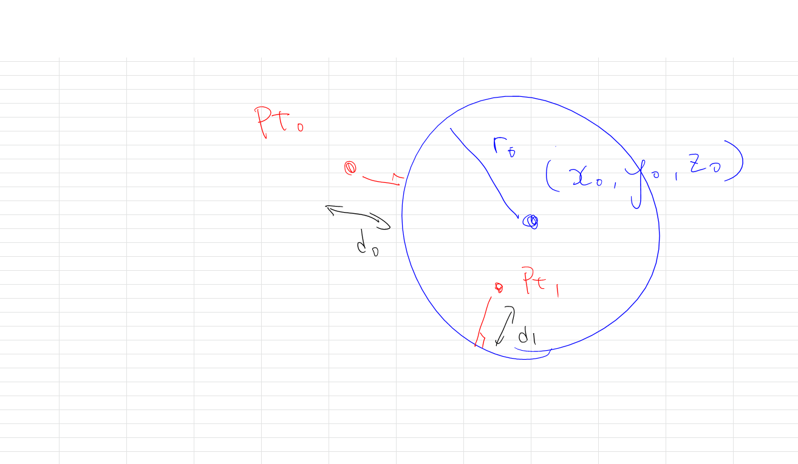

# Calc_Distance_Curve_Point  

2次元の場合と3次元の場合で考える必要があるが、3次元の問題をアフィン変換を用いて2次元の問題に置き換えることができるので、2次元版の実装だけで十分？  

### Line-Point Distace  

直線（無限長さ）の場合と、線分の場合が考えられる。線分の場合と考えると 範囲を絞るような気がするがちょっとわからない。  

一旦直線と点の距離を求める。  

  

### Circle-Point Distace  

  

### Curve-Point Distance  

???  