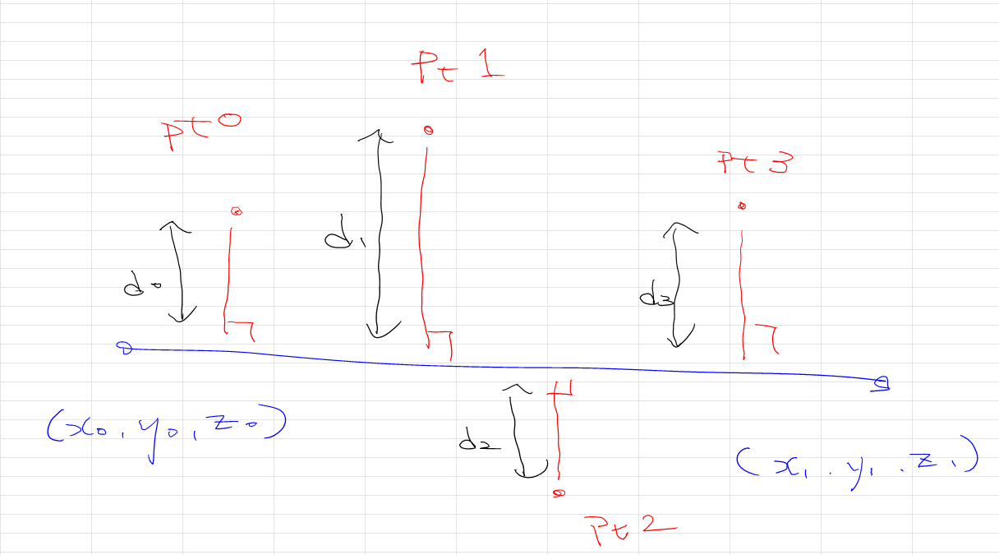
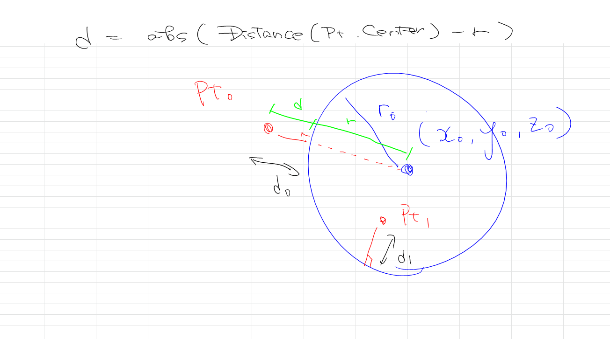

# Calc_Distance_Curve_Point  

2次元の場合と3次元の場合で考える必要があるが、3次元の問題をアフィン変換を用いて2次元の問題に置き換えることができるので、2次元版の実装だけで十分？  

GhPython の中で使うことも考え、Numpy 無し/有りで実装し始めたが、Numpy 無し（GhPython）で重い計算はしないような気がした。  

## Line-Point Distace  

直線（無限長さ）の場合と、線分の場合が考えられる。 ~~線分の場合と考えると範囲を絞るような気がするがちょっとわからない。~~ 検索するとありました。垂線が引けるかで線分内に収まらないのでどちらかの端点をとるべきと判別できるらしい。  

直線と点の距離を求める。Wikipedia に公式が載っていて諸説あることもないので、「直線が通る2点によって定義された直線」の部分の式をそのまま実装した。  

  

## Circle-Point Distace  

直線と点に比べて難しそうだと思っていたが、絵を書いていたら簡単に解けたので感動してしまった。2点間の距離計算で ok。  

2点間の距離計算は、平方根で実装しがちだが（？）、2点を始点と終点に据えたベクトルに置き換えてそのベクトルの大きさをとればスマート。  

  

## Curve-Point Distance  

カーブ？補間？  
スプライン or ベジェ or Nurbs or 刻んで点群で？  
用途に合わせてタイミングが来たら実装します。  

## Ref  

点と直線の距離（Wikipedia）  
  [https://ja.wikipedia.org/wiki/%E7%82%B9%E3%81%A8%E7%9B%B4%E7%B7%9A%E3%81%AE%E8%B7%9D%E9%9B%A2](https://ja.wikipedia.org/wiki/%E7%82%B9%E3%81%A8%E7%9B%B4%E7%B7%9A%E3%81%AE%E8%B7%9D%E9%9B%A2)  

線分と頂点の最短距離（実装メモ (Python)）  
  [https://tjkendev.github.io/procon-library/python/geometry/segment_line_point_distance.html](https://tjkendev.github.io/procon-library/python/geometry/segment_line_point_distance.html)  

NumPyのデータ型dtype一覧とastypeによる変換（キャスト）（note.nkmk.me）  
  [https://note.nkmk.me/python-numpy-dtype-astype/](https://note.nkmk.me/python-numpy-dtype-astype/)  

【python】 Numpyで2点間の距離と角度を求める（Kaggle Note）  
  [https://kagglenote.com/ml-tips/between-two-points/](https://kagglenote.com/ml-tips/between-two-points/)  
